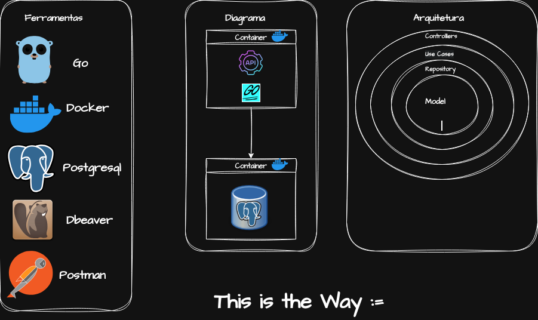

# Projeto: API-REST com Golang, Docker e PostgreSQL

## Introdução

Este projeto foi desenvolvido com o objetivo de criar uma API utilizando Golang, Docker e PostgreSQL, aplicando uma arquitetura bem definida e escalável. A API gerencia dados de forma eficiente e segura, seguindo as melhores práticas do mercado. Abaixo estão descritas as etapas do desenvolvimento, a arquitetura utilizada e as ferramentas integradas.

### Ferramentas Utilizadas

- `Golang:` Linguagem de programação escolhida pela sua performance e facilidade para criar APIs RESTful.
- `Docker:` Para containerizar a aplicação e o banco de dados PostgreSQL, garantindo consistência nos ambientes de desenvolvimento e produção.
- `PostgreSQL:` Banco de dados relacional utilizado para armazenar e gerenciar os dados da aplicação.
- `DBeaver`Ferramenta gráfica utilizada para administração e consulta do banco de dados PostgreSQL, facilitando a visualização e manipulação dos dados de forma intuitiva.
- `Postman:` Ferramenta utilizada para testar as rotas da API e garantir que os endpoints estão funcionando corretamente, simplificando a validação dos fluxos da aplicação.

## Bibliotecas Utilizadas no Projeto

### Bibliotecas da Biblioteca Padrão do Go

- **database/sql********: **Gerencia conexões e interações com bancos de dados SQL, fornecendo uma interface genérica para executar consultas e comandos SQL.

- **fmt********: **Oferece funções para formatação e saída de texto, usado para logs e mensagens no terminal.

### Bibliotecas Internas do Projeto (go-api)

- **go-api/model********:** Define as estruturas de dados (structs) que representam os modelos da aplicação. Essas estruturas são usadas para mapeamento de dados e transporte entre camadas.

- **go-api/repository********: **Implementa a lógica de acesso ao banco de dados, encapsulando consultas SQL e interações diretas com o PostgreSQL.

### Biblioteca Externa

- **github.com/lib/pq********: **Driver PostgreSQL para Go, usado para estabelecer conexões e executar comandos SQL no banco de dados PostgreSQL através da interface genérica database/sql.

## Diagrama de Comunicação
**Abaixo está o diagrama que explica a comunicação entre a API (em Go) e o banco de dados PostgreSQL:**

- O cliente realiza uma `requisição` para a `API`.
- A API processa a requisição através do `Controller`, que delega a lógica de negócio ao Use Case.
- O Use Case interage com o Repository para buscar ou manipular dados no banco de dados `PostgreSQL`.
- O `Repository `executa consultas `SQL`no banco de dados e retorna os resultados ao Use Case.
- O `Use Case` retorna a resposta formatada para o Controller, que envia a resposta final ao cliente.
- 
## Arquitetura da Aplicação
**Camadas da Arquitetura:**

- `Controllers: `Responsáveis por receber as requisições` HTTP `e enviar as respostas. Realizam a validação inicial dos dados recebidos.
- `Use Cases:` Contêm a lógica de negócio da aplicação e interagem com os Repositories para obter ou salvar dados.
- `Repositories`: Responsáveis pela comunicação direta com o banco de dados `PostgreSQL`. Contêm as queries `SQL` ou interagem com bibliotecas - - `ORM`.
- `Models: `Representações das entidades do domínio e definem as estruturas de dados utilizadas nas camadas.
Etapas do Projeto

**Planejamento**

**Definição do escopo do projeto.**
- Escolha das ferramentas e bibliotecas.
- Criação de diagramas para representar a comunicação e a arquitetura.
- Configuração do Ambiente

- Configuração do Docker para containerizar a aplicação e o banco de dados.
- Configuração do PostgreSQL no `Docker Compose`, permitindo que tanto a API quanto o banco de dados rodem em containers separados, mas se - comuniquem facilmente.
  
**Estrutura do Projeto Organização dos diretórios:**

- `/controllers:` Contém os handlers das rotas.
- `/usecases:` Contém a lógica de negócio.
- `/repositories:`Gerencia a interação com o banco de dados.
- `/models:` Define as entidades do domínio.
## Desenvolvimento
- **Testes de integração:** Garantem a comunicação correta entre a API e o banco de dados PostgreSQL.
- Implementação dos casos de uso (Use Cases).
- Desenvolvimento das queries no Repository.
- Definição das entidades no Model.
**Criação das rotas no Controller.**
- Implementação dos casos de uso `(Use Cases)`.
- Desenvolvimento das queries no `Repository`.
- Definição das entidades no `Model`.

## Testes

**Testes unitários para cada camada.**
- *Testes de integração:* Para verificar a comunicação com o banco de dados PostgreSQL.
- **Testes unitários:** Verificam a lógica de cada camada separadamente.
- **Testes de integração:** Garantem a comunicação correta entre a API e o banco de dados PostgreSQL.
  
## Deploy
**Utilização de Docker para gerar imagens da aplicação.**
- Utilização de Docker para gerar imagens da aplicação.
- Deploy em ambiente de produção, utilizando ferramentas como `Kubernetes` (opcional) para orquestração de containers.

## Conclusão

Este projeto demonstra a implementação de uma API robusta e escalável utilizando Golang, Docker e PostgreSQL. A separação em camadas facilita a manutenção e a evolução do sistema, enquanto o uso de Docker garante consistência entre os ambientes de desenvolvimento e produção. Este portfólio pode ser expandido com gráficos e exemplos mais detalhados, conforme necessário.

